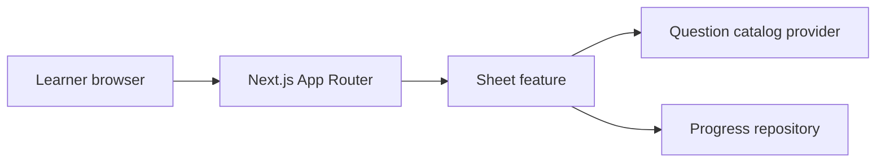
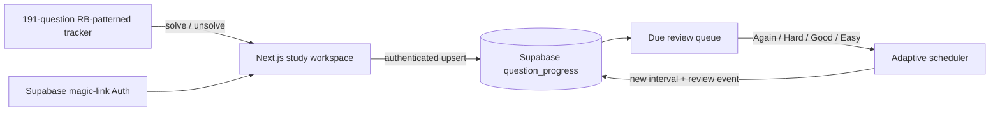

# Danish SDE product architecture

## High-level design



## Low-level boundaries

- `src/app`: route composition only. Pages should not embed catalog or payment logic.
- `src/features/sheet`: tracker UI and future typed catalog/progress providers. The current 191-question tracker is exposed through a temporary adapter at `/tracker`, preserving user-facing behaviour while its static dataset is migrated.

## Data model to implement before launch

```ts
type VideoLink = { provider: "rising-brain" | "striver"; url: string; verifiedAt: string };
type Question = { id: string; title: string; rbPattern: string; difficulty: "Easy" | "Medium" | "Hard"; videos: VideoLink[] };
type Progress = { userId: string; questionId: string; status: "todo" | "solved" | "review"; updatedAt: string };
```

The catalog importer should reject any question missing a verified direct video URL when the product is marketed as having one.

## Cloud study loop



- The tracker stays the canonical learning catalogue and works offline with browser storage.
- The workspace owns authentication, cloud synchronization, gamified metrics, and review interactions.
- Supabase Row Level Security permits a learner to read or write only their own progress and review events.
- Revision is outcome-based: `1 → 3 → 7 → 14 → 30 → 60 → 120` days by default. *Again* brings a question back sooner; *Easy* advances it faster.
